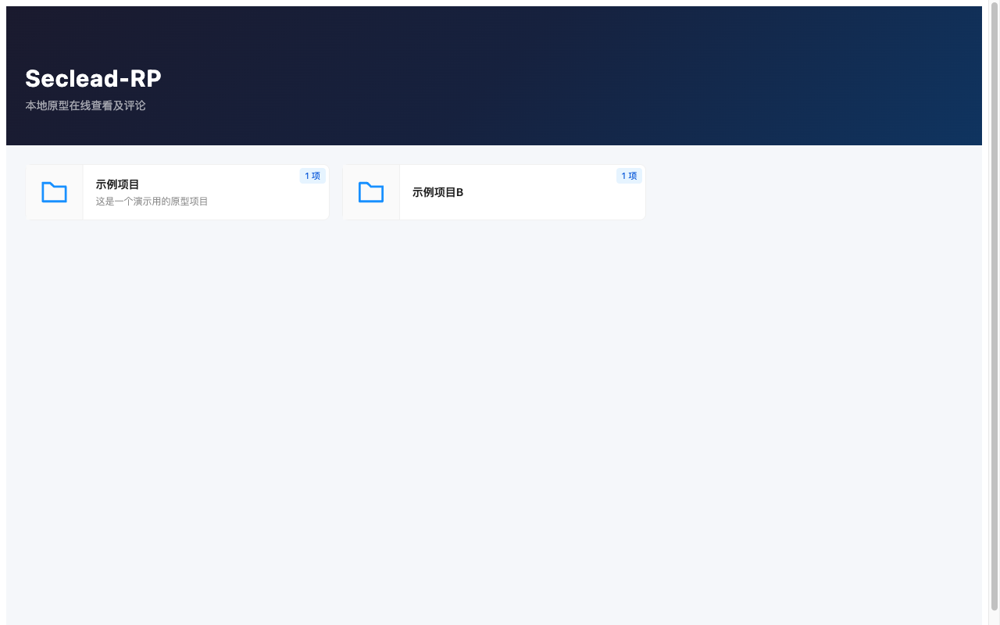
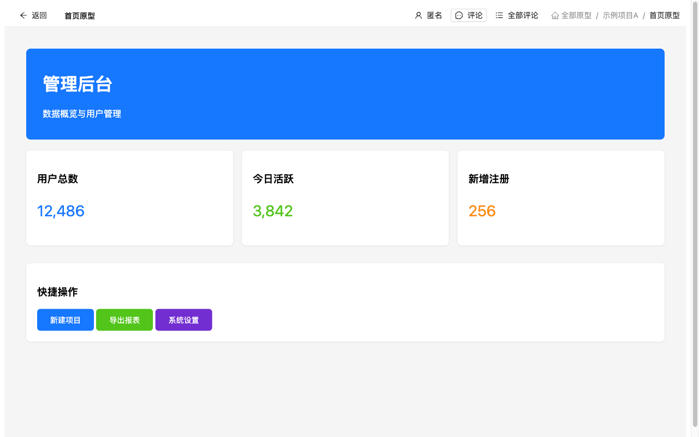
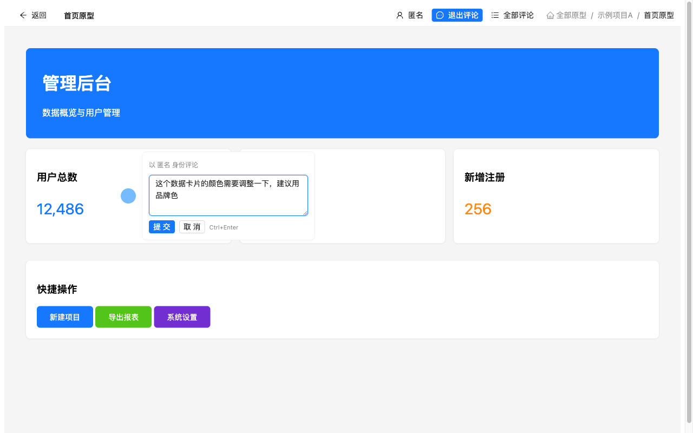

# RP-Viewer

[中文文档](README.zh-CN.md)

A self-hosted prototype review platform. Automatically scans prototype folders generated by tools like Axure and Mockplus, providing card-based browsing, iframe preview, and Figma-style pinned comments.

## Screenshots

**Home - Card-based prototype browsing**



**Prototype Preview - iframe embedded loading**



**Comments - Click to pin comments**



## Quick Start

### 1. Download

Download the binary for your platform from [Releases](https://github.com/chenbin3625/RP-Viewer/releases):

| Platform | File |
|----------|------|
| macOS (Apple Silicon) | `proto-viewer-*-darwin-arm64.tar.gz` |
| macOS (Intel) | `proto-viewer-*-darwin-amd64.tar.gz` |
| Linux (amd64) | `proto-viewer-*-linux-amd64.tar.gz` |
| Linux (arm64) | `proto-viewer-*-linux-arm64.tar.gz` |
| Windows (amd64) | `proto-viewer-*-windows-amd64.zip` |
| Windows (arm64) | `proto-viewer-*-windows-arm64.zip` |

### 2. Prepare Prototype Files

Place your prototype folders in the `prototypes/` directory (or update `config.yaml` to point to your prototype directory):

```
prototypes/
├── ProjectA/                  ← Category folder
│   ├── README.md              ← Optional: first line as title, rest as description
│   ├── icon.png               ← Optional: custom icon
│   ├── Homepage/              ← Prototype folder (contains index.html)
│   │   ├── index.html
│   │   └── ...
│   └── Admin/
│       ├── index.html
│       └── ...
└── ProjectB/
    └── Dashboard/
        ├── index.html
        └── ...
```

**Detection rules:**
- Folder with `index.html` → Prototype (previewable)
- Folder without `index.html` → Category (nestable)
- Folders starting with `.` or `_` are ignored

**Optional metadata:**
- `README.md` / `README.txt` → First line as title, rest as description
- `icon.png` / `icon.jpg` / `icon.svg` → Custom card icon

### 3. Configure

Edit `config.yaml`:

```yaml
# Root directory for prototype files
prototype_dir: ./prototypes

# Server port
port: 8080
```

### 4. Run

```bash
./proto-viewer
```

Open http://localhost:8080 in your browser.

Specify a config file:

```bash
./proto-viewer -config /path/to/config.yaml
```

## Features

### Browse Prototypes
- Card-based display of all prototypes and categories
- Multi-level folder nesting with breadcrumb navigation
- Click category cards to drill down, click prototype cards to preview

### Preview Prototypes
- iframe embedded loading with full prototype interactivity
- Top toolbar with back button and breadcrumb navigation

### Comments
- **Add comments**: Click the "Comment" button in the toolbar to enter comment mode, then click anywhere on the prototype to place a comment
- **View comments**: Blue circle markers appear on the prototype, click to view details
- **Edit comments**: Click the edit icon in the comment popover to modify content
- **Reply to comments**: Reply input at the bottom of each comment, supports multiple replies
- **Manage comments**: Mark as resolved / delete
- **All comments**: Click "All Comments" to open a sidebar with comments from all pages, click to navigate
- **Comment mode only affects left-click**, scrolling and dragging are unaffected
- **Nickname**: Click the username to set a nickname, leave empty for anonymous
- Comment data is stored as JSON files in each prototype's `.comments/` directory

## Docker

```bash
docker run -d \
  -p 8080:8080 \
  -v /path/to/prototypes:/data/prototypes \
  chenbin3625/rp-viewer
```

Environment variables:

| Variable | Default | Description |
|----------|---------|-------------|
| `PROTOTYPE_DIR` | `/data/prototypes` | Prototype files root directory |
| `PORT` | `8080` | Server port |

```bash
docker run -d \
  -p 9090:9090 \
  -e PORT=9090 \
  -v /path/to/prototypes:/data/prototypes \
  chenbin3625/rp-viewer
```

> Images are available for `linux/amd64` and `linux/arm64`.

## Build from Source

Requires Go 1.21+ and Node.js 22+:

```bash
make build        # Production build
make dev          # Dev mode (frontend & backend hot reload)
make clean        # Clean build artifacts
```

## Tech Stack

- **Backend**: Go (net/http, embed)
- **Frontend**: React + TypeScript + Ant Design
- **Deployment**: Single binary with embedded frontend assets
