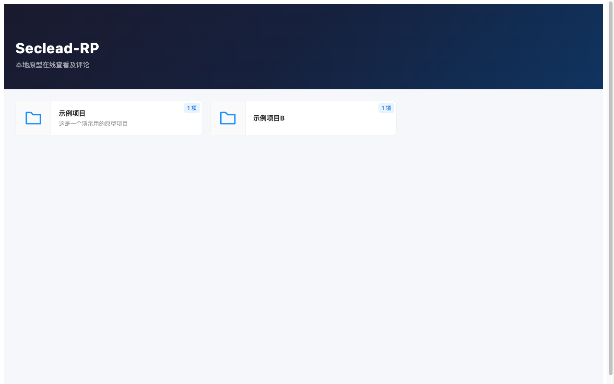
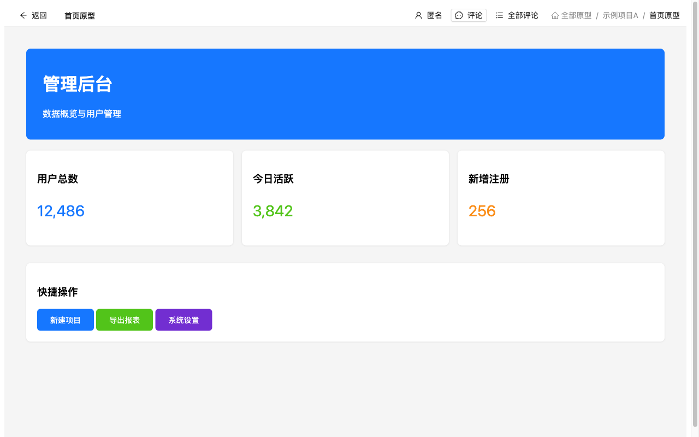
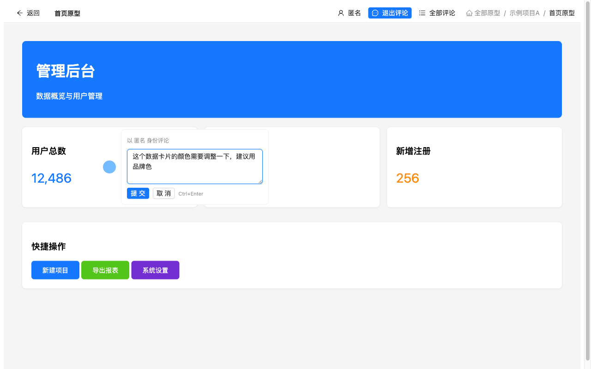

# RP-Viewer

A self-hosted prototype review platform. Automatically scans prototype folders exported from tools like Axure and Mockplus, providing card-based browsing, iframe preview, and Figma-style pinned comments.

## Screenshots

**Home - Card-based browsing**



**Preview - iframe embedded rendering**



**Comments - Click to pin**



## Features

### Browsing
- Automatically scans the prototype directory; categories and prototypes are shown as cards
- Multi-level folder nesting with breadcrumb navigation
- A folder containing `index.html` is detected as a **prototype** (previewable); otherwise as a **category** (nestable)
- Folders starting with `.` or `_` are hidden
- Optional per-folder metadata: `README.md` / `README.txt` (first line as title, rest as description), `icon.png` / `icon.jpg` / `icon.svg` (custom card icon)

### Preview
- Prototypes load in an embedded iframe with full interactivity
- Top toolbar with back navigation and breadcrumb
- SPA-style hash navigation inside the iframe is tracked automatically

### Comments
- **Pin**: enter comment mode and click anywhere on the prototype to drop a pin
- **Threads**: reply to any comment; supports multiple replies
- **Edit / Resolve / Delete**: manage comments from the popover
- **All-comments sidebar**: browse comments across all pages and jump to any of them
- **Non-intrusive**: comment mode only captures left-clicks; scrolling, dragging, and other interactions pass through to the prototype
- **Nickname**: set a display name per browser; empty defaults to anonymous
- Comments persist as JSON files under each prototype's `.comments/` directory

### Security & Performance
- Path-traversal protection on all file access (safe path resolution confined to the prototype root)
- `.comments` directories are blocked from HTTP access to prevent data disclosure
- Inbound request bodies capped at 1 MB; API errors are sanitized to avoid leaking internal paths
- gzip compression (with writer pooling) and Cache-Control headers for static assets
- Health check endpoint at `/healthz`
- Docker image runs as a non-root user with a built-in healthcheck

## Quick Start

### 1. Download

Download the binary for your platform from [Releases](https://github.com/chenbin3625/RP-Viewer/releases):

| Platform | File |
|----------|------|
| macOS (Apple Silicon) | `proto-viewer-*-darwin-arm64.tar.gz` |
| macOS (Intel) | `proto-viewer-*-darwin-amd64.tar.gz` |
| Linux (amd64) | `proto-viewer-*-linux-amd64.tar.gz` |
| Linux (arm64) | `proto-viewer-*-linux-arm64.tar.gz` |
| Windows (amd64) | `proto-viewer-*-windows-amd64.zip` |
| Windows (arm64) | `proto-viewer-*-windows-arm64.zip` |

### 2. Prepare Prototype Files

Place your prototype folders in the `prototypes/` directory:

```
prototypes/
├── ProjectA/                  ← Category folder
│   ├── README.md              ← Optional: title + description
│   ├── icon.png               ← Optional: custom icon
│   ├── Homepage/              ← Prototype folder (contains index.html)
│   │   ├── index.html
│   │   └── ...
│   └── Admin/
│       ├── index.html
│       └── ...
└── ProjectB/
    └── Dashboard/
        ├── index.html
        └── ...
```

### 3. Run

```bash
./proto-viewer
```

Open http://localhost:8080 in your browser. By default RP-Viewer serves prototypes from `./prototypes` on port `8080`.

## Configuration

RP-Viewer reads `config.yaml` by default. **Environment variables override the config file, which overrides the defaults.**

```yaml
# Root directory for prototype files
prototype_dir: ./prototypes

# Server port
port: 8080
```

| Source | `prototype_dir` | `port` |
|--------|-----------------|--------|
| Default | `./prototypes` | `8080` |
| Config file | `prototype_dir` | `port` |
| Environment variable | `PROTOTYPE_DIR` | `PORT` |

Flags:

```bash
./proto-viewer -config /path/to/config.yaml   # Use a custom config file
./proto-viewer -dev                            # Dev mode (proxies frontend to Vite)
```

## Docker

```bash
docker run -d \
  -p 8080:8080 \
  -v /path/to/prototypes:/data/prototypes \
  chenbin3625/rp-viewer
```

The image runs as a non-root user and ships with a `HEALTHCHECK` hitting `/healthz`. Override the port with the `PORT` env var:

```bash
docker run -d \
  -p 9090:9090 \
  -e PORT=9090 \
  -v /path/to/prototypes:/data/prototypes \
  chenbin3625/rp-viewer
```

> Multi-arch images are available for `linux/amd64` and `linux/arm64`.

## Build from Source

Requires Go 1.26+ and Node.js 22+:

```bash
make build        # Production build (frontend + Go binary)
make dev          # Dev mode (frontend & backend hot reload)
make clean        # Clean build artifacts
```

## Tech Stack

- **Backend**: Go (net/http, embed, gzip)
- **Frontend**: React + TypeScript + Ant Design + React Router
- **Deployment**: Single binary with embedded frontend assets

---

# 中文

一个自托管原型评审平台。可自动扫描 Axure、墨刀等工具导出的原型目录，提供卡片式浏览、iframe 预览和类 Figma 的定点评论能力。

## 界面截图

**首页 - 卡片式浏览**


**原型预览 - iframe 内嵌加载**


**评论 - 点击定位**


## 功能

### 浏览
- 自动扫描原型目录，分类与原型以卡片形式展示
- 支持多级文件夹嵌套，面包屑导航
- 包含 `index.html` 的文件夹识别为**原型**（可预览），否则为**分类**（可嵌套）
- 以 `.` 或 `_` 开头的文件夹会被隐藏
- 可选的文件夹元数据：`README.md` / `README.txt`（第一行作为标题，其余作为描述）、`icon.png` / `icon.jpg` / `icon.svg`（自定义卡片图标）

### 预览
- 原型以 iframe 内嵌加载，保留全部交互能力
- 顶部工具栏提供返回与面包屑导航
- 自动跟踪 iframe 内部的 SPA 哈希导航

### 评论
- **定位**：进入评论模式后，在原型任意位置点击即可放置评论标记
- **回复线程**：可对任意评论回复，支持多条回复
- **编辑 / 标记已解决 / 删除**：在评论弹窗中管理评论
- **全部评论侧边栏**：跨页面浏览所有评论，点击可跳转
- **不打扰**：评论模式仅捕获左键单击，滚动、拖拽等操作仍透传给原型
- **昵称**：可按浏览器设置显示昵称，留空则为匿名
- 评论以 JSON 文件持久化在每个原型的 `.comments/` 目录中

### 安全与性能
- 所有文件访问均防路径穿越（安全路径解析，限制在原型根目录内）
- `.comments` 目录禁止通过 HTTP 访问，防止数据泄露
- 入站请求体上限 1 MB；API 错误信息脱敏，避免泄露内部路径
- 静态资源启用 gzip 压缩（写入器复用）与 Cache-Control 缓存头
- 健康检查端点 `/healthz`
- Docker 镜像以非 root 用户运行，内置 healthcheck

## 快速开始

### 1. 下载

从 [Releases](https://github.com/chenbin3625/RP-Viewer/releases) 下载对应平台的二进制文件：

| 平台 | 文件 |
|----------|------|
| macOS (Apple Silicon) | `proto-viewer-*-darwin-arm64.tar.gz` |
| macOS (Intel) | `proto-viewer-*-darwin-amd64.tar.gz` |
| Linux (amd64) | `proto-viewer-*-linux-amd64.tar.gz` |
| Linux (arm64) | `proto-viewer-*-linux-arm64.tar.gz` |
| Windows (amd64) | `proto-viewer-*-windows-amd64.zip` |
| Windows (arm64) | `proto-viewer-*-windows-arm64.zip` |

### 2. 准备原型文件

将原型文件夹放入 `prototypes/` 目录：

```
prototypes/
├── ProjectA/                  ← 分类文件夹
│   ├── README.md              ← 可选：标题与描述
│   ├── icon.png               ← 可选：自定义图标
│   ├── Homepage/              ← 原型文件夹（含 index.html）
│   │   ├── index.html
│   │   └── ...
│   └── Admin/
│       ├── index.html
│       └── ...
└── ProjectB/
    └── Dashboard/
        ├── index.html
        └── ...
```

### 3. 启动

```bash
./proto-viewer
```

浏览器打开 http://localhost:8080 即可。默认从 `./prototypes` 提供原型，端口 `8080`。

## 配置

RP-Viewer 默认读取 `config.yaml`。**环境变量优先于配置文件，配置文件优先于默认值。**

```yaml
# 原型文件根目录
prototype_dir: ./prototypes

# 服务端口
port: 8080
```

| 来源 | `prototype_dir` | `port` |
|--------|-----------------|--------|
| 默认 | `./prototypes` | `8080` |
| 配置文件 | `prototype_dir` | `port` |
| 环境变量 | `PROTOTYPE_DIR` | `PORT` |

命令行参数：

```bash
./proto-viewer -config /path/to/config.yaml   # 指定自定义配置文件
./proto-viewer -dev                            # 开发模式（前端代理到 Vite）
```

## Docker

```bash
docker run -d \
  -p 8080:8080 \
  -v /path/to/prototypes:/data/prototypes \
  chenbin3625/rp-viewer
```

镜像以非 root 用户运行，内置 `HEALTHCHECK` 探测 `/healthz`。可通过 `PORT` 环境变量修改端口：

```bash
docker run -d \
  -p 9090:9090 \
  -e PORT=9090 \
  -v /path/to/prototypes:/data/prototypes \
  chenbin3625/rp-viewer
```

> 镜像支持 `linux/amd64` 与 `linux/arm64` 架构。

## 从源码构建

需要 Go 1.26+ 与 Node.js 22+：

```bash
make build        # 构建生产版本（前端 + Go 二进制）
make dev          # 开发模式（前后端热更新）
make clean        # 清理构建产物
```

## 技术栈

- **后端**: Go (net/http, embed, gzip)
- **前端**: React + TypeScript + Ant Design + React Router
- **部署**: 单二进制文件，前端资源内嵌
